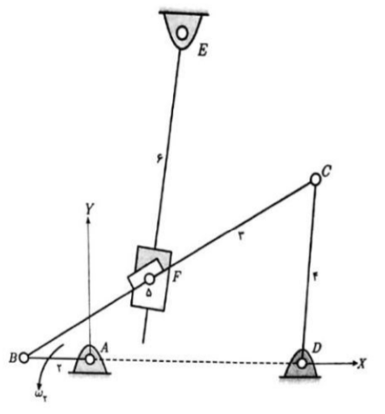

# Dynamics of Machinery - University of Tehran

This repository contains materials related to the **Dynamics of Machinery** course taken at the **University of Tehran**. The course focuses on the analysis and simulation of mechanical systems, including kinematics and dynamics of mechanisms, velocity and acceleration analysis, force analysis, and dynamic modeling.

---

## Course Overview

The course covers key concepts in machinery dynamics, such as:

- **Kinematic Analysis:**  
  - Velocity and acceleration of mechanisms.
  - Graphical and analytical methods for linkages.
  
- **Dynamic Analysis:**  
  - Force and torque calculations in mechanisms.
  - Energy methods and vibration analysis.

- **Simulation Techniques:**  
  - MATLAB-based modeling and simulation.
  - Comparison with commercial software such as **ADAMS** and **SAM**.

---

## Course Project: Mechanism Simulation

This repository includes the implementation of a course project that involves simulating a given mechanical system in MATLAB.

  

The project's main objectives are:

1. **Modeling the Mechanism:**
   - Consider a four-bar linkage mechanism (link 4 moving as a crank-rocker mechanism).
   - Define the appropriate dimensions and initial angles.

2. **Velocity and Acceleration Analysis:**
   - Using vector loop equations to determine angular velocities and accelerations.
   - Set angular velocity of link 1 to a constant value.

3. **Motion Simulation:**
   - Develop an animation in MATLAB to visualize the movement of the mechanism.
   - Ensure step-wise motion updates for accurate visualization.

4. **Point Analysis:**
   - Calculate absolute velocities and accelerations of key points (e.g., B, F5, F6, C).
   - Plot velocity and acceleration diagrams.

5. **Force Analysis:**
   - Calculate the forces acting on joints considering linear density.
   - Assume the mass of the slider to be 1 kg.

6. **Comparison with Commercial Software:**
   - Simulate the same mechanism in **ADAMS** or **SAM** software.
   - Compare the results and analyze discrepancies.

---

## Results and Analysis

The project provides insights into:

- The accuracy of MATLAB-based analytical methods.
- Comparisons with commercial simulation tools.
- Visualization and performance evaluation of the simulated mechanism.

---

## Tools Used

- MATLAB: Modeling and simulation.
- ADAMS/SAM: Commercial software for dynamic analysis.

